<div align="center">

# 🏢 NEXORA — Backend API & Real-Time Engine
### High-Performance RESTful Microservice & WebSocket Architecture

[](https://nodejs.org/)
[](https://expressjs.com/)
[](https://www.mongodb.com/)
[](https://mongoosejs.com/)
[](https://stripe.com/)
[](https://socket.io/)
[](https://zod.dev/)
[](https://www.docker.com/)
[](https://opensource.org/licenses/MIT)

<p align="center">
  <b>A robust, modular backend service orchestrating apartment leases, automated monthly rent billing, Stripe financial transactions, duplex WebSocket communications, and administrative property analytics.</b>
</p>

[📡 Live API Endpoint](https://nexora-server-nine.vercel.app) • [🌐 Frontend App](https://nexora-client.vercel.app) • [📑 Report Issue](https://github.com/Tajuddin80/Nexora-server/issues)

</div>

---

## 📑 Table of Contents
- [🌟 System Overview](#-system-overview)
- [🏗️ Architectural Design (Routes → Controllers → Services)](#️-architectural-design)
- [✨ Key Engine Capabilities](#-key-engine-capabilities)
- [🛠️ Tech Stack & Dependencies](#️-tech-stack--dependencies)
- [🔒 Security & Middleware Pipeline](#-security--middleware-pipeline)
- [🌐 Comprehensive API Reference](#-comprehensive-api-reference)
- [⏰ Automated Cron & Penalty Engine](#-automated-cron--penalty-engine)
- [💻 Local Development](#-local-development)
- [🐳 Docker & Containerization](#-docker--containerization)
- [☁️ Vercel Serverless Deployment](#️-vercel-serverless-deployment)
- [🗺️ Future Engineering Roadmap](#️-future-engineering-roadmap)
- [👤 Author & Contact](#-author--contact)

---

## 🌟 System Overview

**Nexora Backend** is an enterprise-grade RESTful API built on **Node.js 22** and **Express 5**. Designed with a strict **Layered Architecture (Routes → Controllers → Services)**, the engine separates transport logic, request validation, business rules, and database operations into decoupled, testable modules.

### Engineering Highlights:
* **Zero Cold-Start DB Connection Caching**: Built for both persistent Node.js servers and serverless AWS Lambda environments (Vercel) with shared Mongoose connection promises.
* **Dual Authentication Verification**: Integrates `Better Auth` session authentication alongside Bearer JWT authorization tokens and client verification headers.
* **Resilient Financial Transactions**: Stripe PaymentIntents integration with dynamic coupon calculation, audit logging, and payment verification.
* **Automated Cron Jobs**: Scheduled monthly rent generation and automated lease penalty enforcement (downgrading chronic defaulters and re-opening apartments).
* **Duplex WebSocket Engine**: Socket.IO server powering real-time tenant-admin chat channels with delivery and read receipts.

---

## 🏗️ Architectural Design

```
Nexora-server/
├── api/
│   └── index.js                     # Serverless handler for Vercel deployment
├── app.js                           # Express application, security headers, CORS & routes
├── index.js                         # HTTP & Socket.IO server initialization & DB startup
├── config/
│   ├── auth.js                      # Better Auth configuration & MongoDB client adapter
│   ├── db.js                        # Promise-cached Mongoose connection with timeout guards
│   └── initAdmin.js                 # Automatic seed & ensure root administrator account
├── cron/
│   └── rentCron.js                  # Automated 1st-of-month billing & 3-month penalty check
├── middleware/
│   ├── auth.js                      # Dual JWT & Better Auth session RBAC middleware
│   └── rateLimiter.js               # Express rate limiting to prevent brute-force & DoS
├── models/                          # Mongoose Schemas & Database Models
│   ├── User.js                      # User profile, role (user/member/admin), rent history
│   ├── Apartment.js                 # Apartment inventory, floor, block, pricing, availability
│   ├── Agreement.js                 # Lease agreements, approvals, and lifecycle statuses
│   ├── RentPayment.js               # Ledger of paid/unpaid rent, Stripe transactions
│   ├── Coupon.js                    # Promotional discount codes and expiration dates
│   ├── Announcement.js              # Property-wide broadcast notices
│   └── Message.js                   # WebSocket chat messages & read receipts
├── modules/                         # Business Modules (Routes -> Controllers -> Services)
│   ├── admin/                       # Dashboard metrics, revenue aggregations, member removal
│   ├── agreement/                   # Lease request workflows & auto-acceptance routines
│   ├── apartment/                   # Paginated apartment search, filtering, and CRUD
│   ├── chat/                        # Direct chat history & unread message count
│   ├── coupon/                      # Coupon validation & management
│   ├── rentPayment/                 # Stripe PaymentIntents & payment ledger updates
│   ├── upload/                      # Cloudinary media storage & avatar upload routes
│   └── user/                        # Authentication, registration, and role sync
└── validators/
    └── schemas.js                   # Type-safe Zod validation schemas
```

---

## ✨ Key Engine Capabilities

### 1. Layered Modular Architecture
* **Routes**: Pure routing declarations with attached validation and authorization middlewares.
* **Controllers**: HTTP request/response handlers with status code mapping and standardized JSON payloads.
* **Services**: Isolated business logic, database queries, Stripe API calls, and domain transactions.

### 2. Financial & Stripe Integration
* Server-side calculation of net payable rent with coupon discount verification.
* Direct creation of **Stripe PaymentIntents** with strict currency tokenization.
* Webhook-compatible transaction ID recording and immutable rent ledger entries.

### 3. Automated Resident Lifecycle & Penalty Engine
* **Automatic Role Promotion**: When an administrator approves a lease request, the user is automatically upgraded to `member` and the apartment is locked from further applications.
* **Cron-Driven Rent Generation**: On the 1st of every month at midnight, bills are automatically generated for all active members.
* **Default Enforcement**: If a member accumulates **3 or more consecutive unpaid months**, the engine automatically downgrades their role back to `user`, terminates the lease, and returns the apartment to the public market.

---

## 🛠️ Tech Stack & Dependencies

| Layer | Technology | Version | Purpose |
| :--- | :--- | :--- | :--- |
| **Runtime** | Node.js | `v22.x` | Modern JavaScript runtime |
| **Framework** | Express.js | `v5.1` | High-throughput web routing framework |
| **Database** | MongoDB Atlas | `v6.x` | Scalable NoSQL cloud database |
| **ORM / ODM** | Mongoose | `v9.9` | Schema modeling and aggregation pipelines |
| **Payments** | Stripe SDK | `v18.3` | PaymentIntent generation and card confirmation |
| **WebSockets** | Socket.IO | `v4.8` | Bi-directional event-based socket protocol |
| **Validation** | Zod | `v3.24` | Strict schema validation with descriptive error messages |
| **Security** | bcryptjs & JWT | `v2.4` / `v9.0` | Password hashing (salt: 10) & Bearer token signing |
| **Rate Limiting** | express-rate-limit | `v7.5` | IP rate-limiting to protect against DDoS attacks |
| **Task Scheduling** | node-cron | `v4.2` | Cron-based background automation |
| **Cloud Storage** | Cloudinary SDK | `v2.5` | Asset CDN for property images and chat media |

---

## 🔒 Security & Middleware Pipeline

```mermaid
graph LR
    Req[Incoming HTTP Request] --> SecHeaders[Security Headers nosniff / SAMEORIGIN]
    SecHeaders --> RateLimit[Global Rate Limiter]
    RateLimit --> CORS[CORS Origin Whitelist]
    CORS --> DB[Cached Database Connection]
    DB --> Auth[Dual Auth: Better Auth / JWT Bearer]
    Auth --> Zod[Zod Schema Validation]
    Zod --> Controller[Controller & Service Logic]
    Controller --> Res[Standardized JSON Response]
```



---

## 🌐 Comprehensive API Reference

### 🔐 Authentication & Accounts
| Method | Endpoint | Description | Access |
| :--- | :--- | :--- | :--- |
| `ALL` | `/api/auth/*` | Better Auth endpoints (sign-in, sign-up, session, OAuth) | Public |
| `POST` | `/users/login` | Email & password login (returns JWT & role) | Public |
| `POST` | `/users` | Create or update user account | Public (Zod) |
| `GET` | `/users/:email/role` | Fetch current role (`user`, `member`, `admin`) | Authenticated |

### 🏢 Apartments
| Method | Endpoint | Description | Access |
| :--- | :--- | :--- | :--- |
| `GET` | `/apartments` | Paginated apartment list (`page`, `limit`, `minRent`, `maxRent`, `sort`) | Public |
| `POST` | `/apartments` | Create new apartment unit | Admin (Zod) |
| `PATCH` | `/apartments/:id` | Update apartment details | Admin (Zod) |
| `DELETE` | `/apartments/:id` | Delete apartment unit | Admin |

### 📄 Lease Agreements
| Method | Endpoint | Description | Access |
| :--- | :--- | :--- | :--- |
| `POST` | `/agreements` | Submit apartment lease request | Authenticated (Zod) |
| `GET` | `/agreements` | Get agreement requests by status (`?status=pending`) | Admin |
| `PATCH` | `/agreements/:id` | Approve (`action: "accept"`) or reject agreement | Admin |
| `GET` | `/agreements/user/:email` | Get user lease agreements list | Authenticated |

### 💳 Rent Payments & Stripe
| Method | Endpoint | Description | Access |
| :--- | :--- | :--- | :--- |
| `POST` | `/create-payment-intent` | Create Stripe PaymentIntent with optional coupon discount | Member (Zod) |
| `POST` | `/rent-payments` | Record successful rent transaction | Authenticated (Zod) |
| `GET` | `/rent-payments/:email` | Fetch rent payments ledger (`?status=paid/unpaid`) | Authenticated |
| `PATCH` | `/rent-payments/:id` | Update payment record status with transaction ID | Authenticated |
| `GET` | `/stripe-publishable-key` | Retrieve configured Stripe publishable key fallback | Public |

### 🎟️ Coupons
| Method | Endpoint | Description | Access |
| :--- | :--- | :--- | :--- |
| `GET` | `/coupons` | List all available promotional coupons | Public |
| `POST` | `/coupons/validate` | Validate coupon code & return discount % | Member |
| `POST` | `/coupons` | Create promotional coupon | Admin (Zod) |
| `PATCH` | `/coupons/:id` | Update coupon details | Admin (Zod) |
| `DELETE` | `/coupons/:id` | Delete coupon by ID | Admin |

### 📊 Admin Analytics & Members
| Method | Endpoint | Description | Access |
| :--- | :--- | :--- | :--- |
| `GET` | `/admin/stats` | Aggregated KPIs (Total rooms, availability %, users, members) | Admin |
| `GET` | `/members` | Get all active members with apartment & lease info | Admin |
| `PATCH` | `/members/:email/remove` | Downgrade member role to user & vacate apartment | Admin |
| `GET` | `/members/:email/due-months`| Inspect unpaid rent months for resident | Admin |

---

## ⏰ Automated Cron & Penalty Engine

The server includes automated cron jobs scheduled via `node-cron`:

```javascript
// Runs on the 1st of every month at 00:00 (Midnight)
cron.schedule("0 0 1 * *", async () => {
  await processMonthlyRentAndPenalties();
});
```

* **Step 1 (Billing)**: Loops through all accepted lease agreements, checks if a bill for the current month exists, and generates a new unpaid invoice if missing.
* **Step 2 (Penalty Check)**: Identifies members with **≥ 3 unpaid bills**, automatically downgrades their role to `user`, terminates their lease agreement, and marks the apartment available (`available: true`).

---

## 💻 Local Development

### Prerequisites
* **Node.js**: `v20.x` or `v22.x`
* **MongoDB**: Atlas connection string or local MongoDB instance

### Installation Steps

1. **Clone the repository**:
   ```bash
   git clone https://github.com/Tajuddin80/Nexora-server.git
   cd Nexora-server
   ```

2. **Install dependencies**:
   ```bash
   npm install
   ```

3. **Configure Environment Variables**:
   Create a `.env` file from the template:
   ```bash
   cp .env.example .env
   ```
   Add your credentials:
   ```env
   PORT=5000
   MONGODB_URI=mongodb+srv://<username>:<password>@cluster.mongodb.net/Nexora?retryWrites=true&w=majority
   STRIPE_SECRET_KEY=sk_test_...
   BETTER_AUTH_SECRET=your_auth_secret_key
   BETTER_AUTH_URL=http://localhost:5000
   ADMIN_EMAIL=admin@nexora.com
   ADMIN_PASSWORD=admin@123
   CLIENT_URL=http://localhost:5173
   ```

4. **Start Development Server**:
   ```bash
   npm run dev
   ```

---

## 🐳 Docker & Containerization

The backend is fully containerized with a production **Node 22 Alpine** image including built-in health monitoring.

### Standalone Backend Container:
```bash
# Build the image
docker build -t nexora-backend .

# Run container with environment file
docker run -d -p 5000:5000 --env-file .env --name nexora-api nexora-backend
```

### Full-Stack Orchestration (Docker Compose):
From the root repository directory:
```bash
docker compose up --build -d
```
* **Frontend**: [http://localhost:80](http://localhost:80) (Nginx SPA)
* **Backend API**: [http://localhost:5000](http://localhost:5000) (Node/Express API)

---

## ☁️ Vercel Serverless Deployment

Nexora Backend is ready for deployment as an Express Serverless Function on Vercel:

1. **Whitelist IP on MongoDB Atlas**:
   In [MongoDB Atlas](https://cloud.mongodb.com), go to **Network Access** and ensure `0.0.0.0/0` is added to your IP whitelist (mandatory for dynamic AWS Lambda IPs).

2. **Import into Vercel**:
   * Root Directory: `Nexora-server`
   * Framework Preset: `Other`
   * Add all keys from your `.env` under **Environment Variables**.
   * Deploy!

---

## 🗺️ Future Engineering Roadmap

- [ ] **Redis Pub/Sub Architecture**: Scale Socket.IO horizontally across multi-container Kubernetes pods.
- [ ] **Stripe Webhook Handlers**: Asynchronous processing of chargebacks, dispute resolutions, and automatic refunds.
- [ ] **SMS Rent Alerts via Twilio**: Automated SMS notifications 3 days before rent due dates.
- [ ] **Swagger / OpenAPI Documentation**: Interactive OpenAPI 3.0 specification generated at `/api/docs`.
- [ ] **CI/CD Quality Gates**: Automated linting and unit testing via GitHub Actions.

---

## 👤 Author & Contact

**Taj Uddin**  
Full-Stack Software Engineer  
* 📧 Email: [tajuddin.cse.dev@gmail.com](mailto:tajuddin.cse.dev@gmail.com)  
* 🐙 GitHub: [@Tajuddin80](https://github.com/Tajuddin80)  
* 💼 LinkedIn: [Connect on LinkedIn](https://www.linkedin.com/in/tajuddin80/)

---

<div align="center">
  <sub>Engineered for reliability, security, and scale. Licensed under the MIT License.</sub>
</div>
